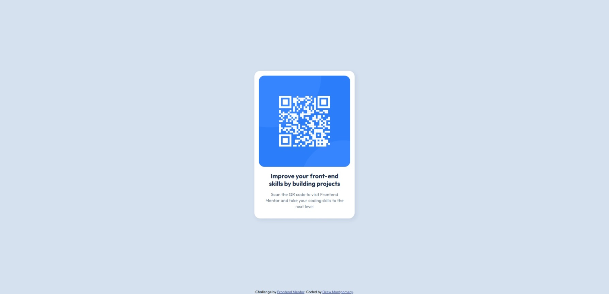

# Frontend Mentor - QR code component solution

This is a solution to the [QR code component challenge on Frontend Mentor](https://www.frontendmentor.io/challenges/qr-code-component-iux_sIO_H). Frontend Mentor challenges help you improve your coding skills by building realistic projects. 

## Table of contents

- [Overview](#overview)
  - [Screenshot](#screenshot)
  - [Links](#links)
- [My process](#my-process)
  - [Built with](#built-with)
  - [What I learned](#what-i-learned)
  - [Continued development](#continued-development)
- [Author](#author)

**Note: Delete this note and update the table of contents based on what sections you keep.**

## Overview

### Screenshot



### Links

- Solution URL: [Solution Github Repo](https://github.com/DrewM64/fm-qr-component)
- Live Site URL: [Live Site](https://drewm64.github.io/fm-qr-component/)

## My process

### Built with

- Semantic HTML5 markup
- CSS custom properties
- CSS Grid

### What I learned

As this was a beginner project and I already have some familiarity with frontend web development, there wasn't much that was new to me in this project. However, I did become more comfortable with CSS Grid and git version control. 

In the past, I could never wrap my head around Grid; even with a guide, it was difficult for me to understand how to make the layout do what I wanted it to. But for this project, keeping it as simple as trying to put the card and attribution into one centered column helped to not make things overwhelming. 

Here is the Grid-related code, for reference:

```css
body {
  display: grid;
  grid-template-rows: 1fr auto; /* main takes space, attribution hugs content */
  min-height: 100vh;
  margin: 0;
}

.card {
  align-self: center;
  justify-self: center;
  /* card element stretches to fill the length of the space without these two lines above */
}
```

As for git, my past trouble was actually in initializing projects with git. Specifically, I felt that I could never get down the workflow to properly and cleanly set up a Github repo and connect it with a project saved locally on my machine. The workflow presented by the "Getting Started" learning path feels like something I can easily grasp and repeat.

1. Create local folder
2. Create Github repo
3. Initialize with git in terminal:
```
echo "# git-test" >> README.md
git init
git add README.md
git commit -m "first commit"
git branch -M main
git remote add origin https://github.com/<username>/git-test.git
git push -u origin main
```

### Continued development

In future projects, I'd like to practice more with CSS Grid and Flexbox. I already understand that Grid is better suited for page layout and Flexbox for smaller elements. Hopefully, getting a better grasp on the two will help make styling pages easier. 

I tried using Flexbox instead of Grid for this project when attempting to align the attribution to the bottom of the page, but it caused unintended behavior so I went with Grid instead. 

## Author

- Website - [DrewM64](https://github.com/DrewM64)
- Frontend Mentor - [@DrewM64](https://www.frontendmentor.io/profile/DrewM64)
